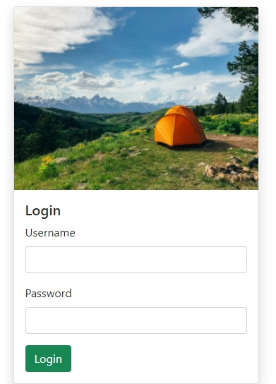
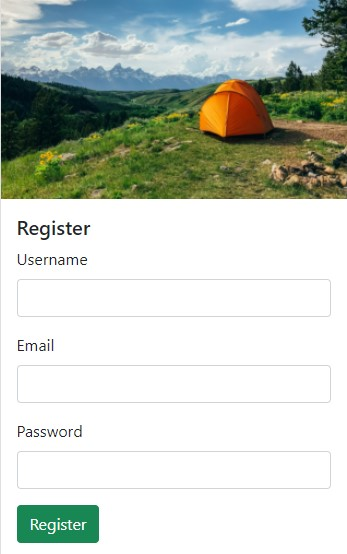
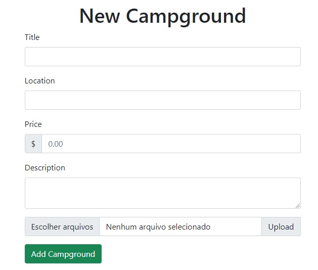
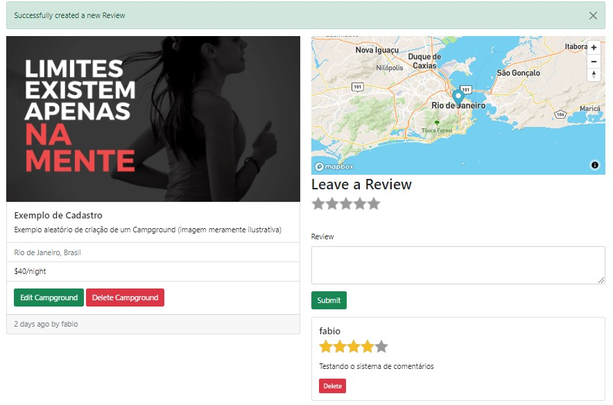

# Sobre

Um grande projeto realizado como conclusão do curso "The WEB Developer Booptcamp 2021" ministrado pelo professor Colt Steele

Diversos novos conceitos foram adquiridos no decorrer desse projeto, muitos que preciso revisar mais vezes para absorver, mas no final de tudo foi uma excelente experiência

## Linguagens e Conceitos

<i>(Obs.: tópicos em inglês visto que esta foi a linguagem do curso)</i>

- HTML5
- Semantic HTML
- Accessibility
- CSS3 Essencials
- Flexbox & Layout
- CSS Animations
- Responsive Design
- CSS Frameworks
- Bootstrap
- JavaScript Basics
- All Modern JS Syntax
- DOM Manipulation
- Asynchronous JavaScript
- AJAX & JSON
- Working with API'S
- Using the Terminal
- Unix Commands
- NodeJS & NPM
- Express
- Web Frameworks
- Templating
- RESTful API's
- Databases
- Mongo DB
- Developer Mindset
- Security
- Deploying
- Mongo Cloud Atlas
- Mongoose
- Schoma Design
- Authentication
- Authorization
- Cookies & Sessions
- Image Upload
- Geocoding & Maps

Obs.: Todo projeto foi feito em conjunto com o instrutor através de seus tutoriais, documentações e fórum de dúvidas

## Preview

    

    

    

    

